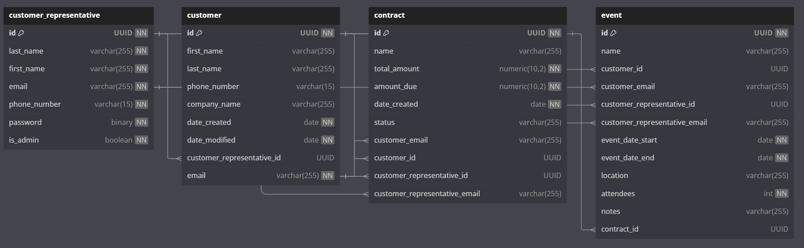

# Epic Events CRM
An inline CRM system developed with #Python, #SQlite and #SQLAlchemy.
This project is about managing and securing client data, ensuring seamless exchanges between python objects and database.

## Prerequisites

 - Python
 - pip

## Quick start

#### Install environment :

 - Create virtual environment : `python -m venv .venv`
 - Activate venv : `.venv/Scripts/activate`
 - Install dependencies : `pip install -r requirements.txt`
 - run Main.py `python main.py`
#### Admin test account :
Administrator account can be logged using these credentials :
 - Login : `admin`
 - Password : `admin`

## Run tests

Tests settings already specified in `.coveragerc` file.
 1. Run tests : `coverage run -m pytest`
 2. Generate coverage report : `coverage html`

`"htmlcov"` folder will be found at the project's root folder. Please find `"index.html"` containing the report.

## Database Diagram :

